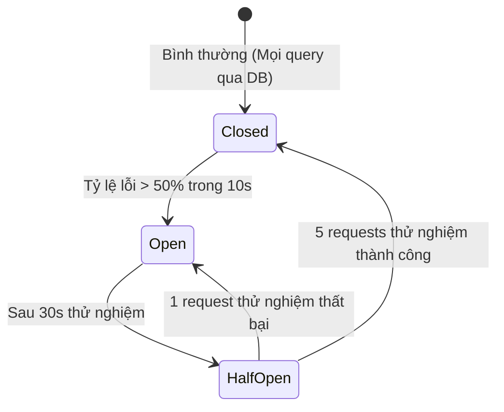

# MAPGO CHAOS ENGINEERING & RESILIENCE SPECIFICATION

## 1. Mục tiêu (Goals)
Xác thực hệ thống MapGo có khả năng **Tự phục hồi (Self-Healing)** và **Thoái lui mềm dẻo (Graceful Degradation)** khi xảy ra sự cố phần cứng, mạng hoặc dịch vụ phụ trợ.

---

## 2. Kịch bản Chaos Testing (Chaos Scenarios)

### Kịch bản 1: PostgreSQL Sập / Mất kết nối DB (Database Outage)
- **Hành vi kiểm tra**: Tắt tiến trình PostgreSQL (`systemctl stop postgresql`) trong 60 giây khi đang có 500 CCU.
- **Kỳ vọng phục hồi (Graceful Degradation)**:
  - Tầng API không trả mã 500 sụp đổ hàng loạt.
  - Circuit Breaker tự động mở (`OPEN`), chuyển hướng đọc dữ liệu từ **Stale Geohash Cache** hoặc **Materialized Snapshot**.
  - Người dùng vẫn xem được bãi xe gần nhất với banner cảnh báo: *"Dữ liệu đang ở chế độ ngoại tuyến"*.
  - Khi PostgreSQL online trở lại: Circuit Breaker tự động chuyển sang trạng thái `HALF-OPEN` $\rightarrow$ `CLOSED`.

### Kịch bản 2: Redis Cluster Sập (Distributed Cache Outage)
- **Hành vi kiểm tra**: Chặn cổng 6379 bằng iptables.
- **Kỳ vọng phục hồi**:
  - Ứng dụng tự động fallback về **Local In-Memory LRU Cache**.
  - Không chặn luồng xử lý chính của Node.js event loop.

### Kịch bản 3: Tải tăng đột biến 10.000 CCU (Spike / Load Shedding)
- **Hành vi kiểm tra**: Bắn lưu lượng gấp 10 lần tải thiết kế trong 30 giây.
- **Kỳ vọng phục hồi**:
  - Middleware kích hoạt Rate Limiter và trả mã `HTTP 429 Too Many Requests` cho các IP vượt quota.
  - Bảo toàn 100% tài nguyên CPU/RAM cho các phiên người dùng hợp lệ.

---

## 3. Ma trận Circuit Breaker (State Transition Matrix)

