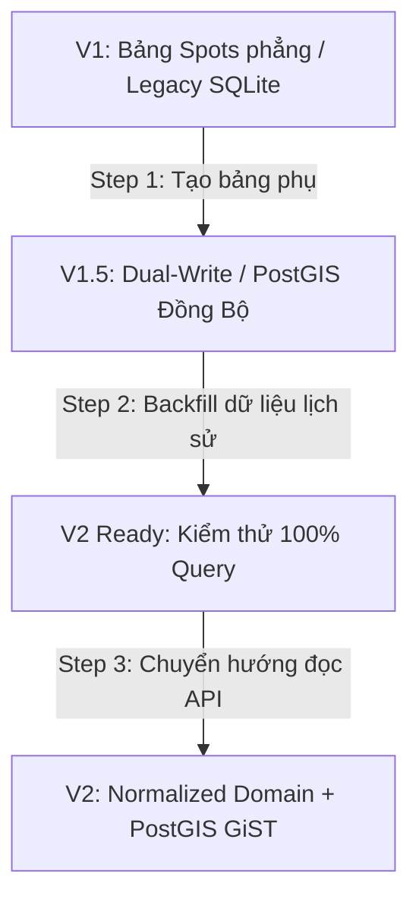

# MAPGO ZERO-DOWNTIME MIGRATION & ROLLBACK STRATEGY

## 1. Nguyên tắc cốt lõi (Core Principles)
1. **Expand and Contract Pattern**: Luôn mở rộng (thêm bảng/cột mới) trước khi co hẹp (xóa cột cũ).
2. **Zero Breaking Changes**: Tầng API & UI luôn hỗ trợ cả hai định dạng dữ liệu (V1 Legacy & V2 Normalized) trong thời gian chuyển tiếp (Grace Period 30 ngày).
3. **Automated Data Backfill & Idempotency**: Mọi script di chuyển dữ liệu (`scripts/seed-normalized-domain.js`) đều có tính lũy suy (Idempotent) – chạy lại nhiều lần không sinh trùng dữ liệu.

---

## 2. Lộ trình Di chuyển Dữ liệu 3 Bước (3-Step Migration Path)



### Bước 1: Khởi tạo Schema V2 (Non-destructive)
- Tạo các bảng Normalized (`spot_parking_details`, `spot_pricing`, `spot_verification`, `spot_payment_methods`).
- Cấp quyền truy cập đầy đủ cho user ứng dụng `erp`.

### Bước 2: Backfill Dữ liệu Tự động (Offline / Online Batching)
- Chạy worker chuyển dịch dữ liệu `scripts/seed-normalized-domain.js` theo batch 500 records.
- Gán nhãn `source = 'MIGRATION_V1'` để phân biệt dữ liệu cũ và mới.

### Bước 3: Chuyển hướng Query (Traffic Switch)
- Bật cờ `USE_POSTGIS_SPATIAL=true` trên biến môi trường `.env`.
- Chuyển hướng các API tìm kiếm bán kính (`/api/spots`, `/api/nearby`) sang hàm PostGIS `ST_DWithin` & `ST_Distance`.

---

## 3. Kế hoạch Hoàn tác (Rollback Strategy)

Nếu phát sinh lỗi nghiêm trọng sau khi triển khai, thực hiện quy trình hoàn tác 3 phút:

```bash
# 1. Chuyển cờ môi trường về V1 Engine
sed -i 's/USE_POSTGIS_SPATIAL=true/USE_POSTGIS_SPATIAL=false/g' .env

# 2. Hoàn tác mã nguồn Git về Commit ổn định gần nhất
git checkout <last-stable-commit-hash>

# 3. Khởi động lại dịch vụ PM2
pm2 restart parking-hcm

# 4. Kiểm tra sức khỏe hệ thống
curl -I http://localhost:3003
```
