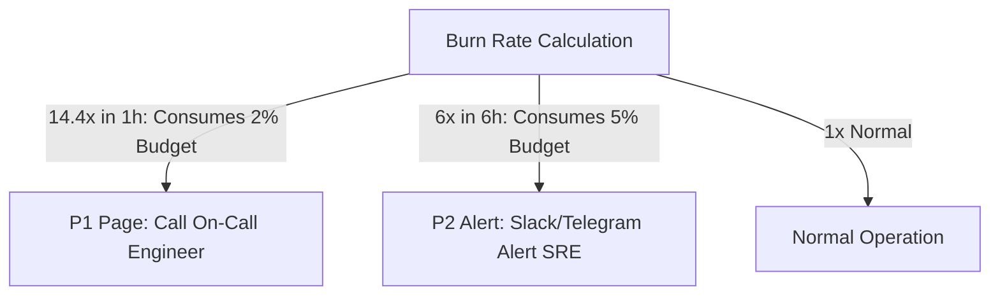

# MAPGO SRE: SLO, SLI & ERROR BUDGET SPECIFICATION

## 1. Service Level Indicators (SLI) & Objectives (SLO)

| Service / Endpoint | Service Level Indicator (SLI) | Target (SLO - 30 days) | Error Budget |
|---|---|---|---|
| **Core Availability** | `sum(rate(http_requests_total{status=~"2..|3.."}[30d])) / sum(rate(http_requests_total[30d]))` | **99.90% Uptime** | 43.2 minutes / month |
| **Search & Nearby API Latency** | `histogram_quantile(0.95, sum(rate(http_request_duration_seconds_bucket{endpoint="/api/spots"}[30d])) by (le))` | **P95 < 150ms** | 5% requests > 150ms |
| **Spatial Radius Latency** | `histogram_quantile(0.99, sum(rate(http_request_duration_seconds_bucket{endpoint="/api/nearby"}[30d])) by (le))` | **P99 < 300ms** | 1% requests > 300ms |
| **API Error Rate** | `sum(rate(http_requests_total{status=~"5.."}[5m])) / sum(rate(http_requests_total[5m]))` | **< 0.10% Errors** | 0.10% requests |
| **Spatial Cache Hit Ratio** | `rate(mapgo_cache_hits_total[5m]) / (rate(mapgo_cache_hits_total[5m]) + rate(mapgo_cache_misses_total[5m]))` | **> 85.0% Hits** | 15% misses |

---

## 2. Error Budget Policy & Burn Rate Alerts

- **Burn Rate 14.4x (1h)**: Nếu tiêu hao > 2% Error Budget trong 1 giờ $\rightarrow$ Kích hoạt Alert khẩn cấp (P1 Call).
- **Burn Rate 6x (6h)**: Nếu tiêu hao > 5% Error Budget trong 6 giờ $\rightarrow$ Tạo ticket cảnh báo SRE (P2 Alert).
- **Chính sách đóng băng Feature (Feature Freeze)**: Nếu Error Budget trong tháng còn < 10%, toàn bộ nguồn lực chuyển sang fix bug hiệu năng và ổn định hệ thống.
